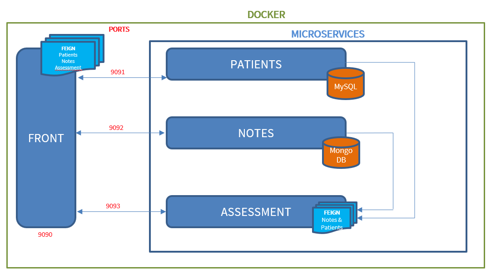
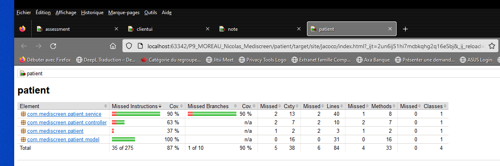
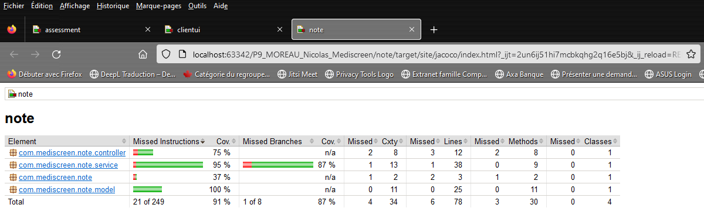
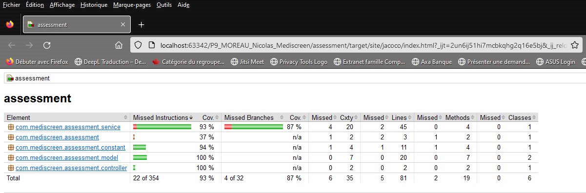
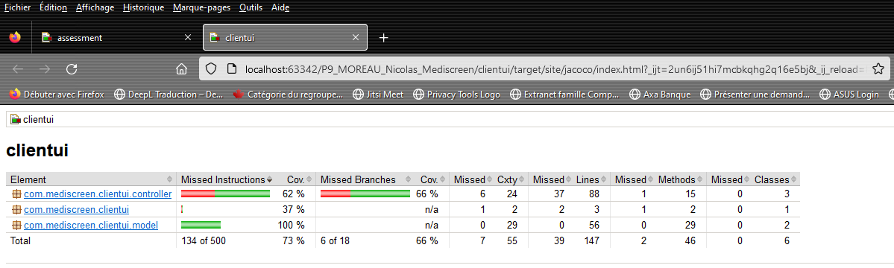

# Mediscreen

**Mediscreen** est une _application Web_ dont le but est de déterminer les patients les plus à
risque au niveau diabète de type 2.

## Stack technique

 

  

 

  
 

## Microservices

Le back-end est développé avec _Spring Boot_ est divisé en 4 _microservices_ :

### Port: 9090

- [Clientui](clientui) : l'UI développé avec Thymeleaf

### Port: 9091

- [Patient](patient) : gère les données sur l'identité des patients (création, mise à jour, suppression ...).

### Port: 9092

- [Note](note) : gère la traçabilité des consultations des patients (Notes des médecins)

### Port: 9093

- [Assessment](assessment) : détermine le niveau de risque (diabète) d'un patient .

## Architecture Logiciel

## Installation

- Cloner ce repository : git
  clone [https://github.com/Nicolas-Jc/P9_MOREAU_Nicolas_Mediscreen.git](https://github.com/Nicolas-Jc/P9_MOREAU_Nicolas_Mediscreen.git)

- Créer une base de données MySQL et adapter le fichier de configuration :
    - [application.properties](patient/src/main/resources/application.properties) (patient-microservice)

- Créer une base de données MongoDB et adapter le fichiers de configuration :
    - [application.properties](note/src/main/resources/application.properties) (note-microservice)

## Docker compose

Pour lancer le projet avec Docker compose:

A la racine du projet, lancer les 2 commandes suivantes séquentiellement :

- **mvn clean install -DskipTests**
- **docker-compose up**

## Rapports de Test

### Patient

### Note

### Assessment

### ClientUI

## API Endpoints Documentation

Swagger link for Patient-microservice : http://localhost:9091/swagger-ui/#/

Swagger link for Note-microservice : http://localhost:9092/swagger-ui/#/

Swagger link for Assessment-microservice : http://localhost:9093/swagger-ui/#/